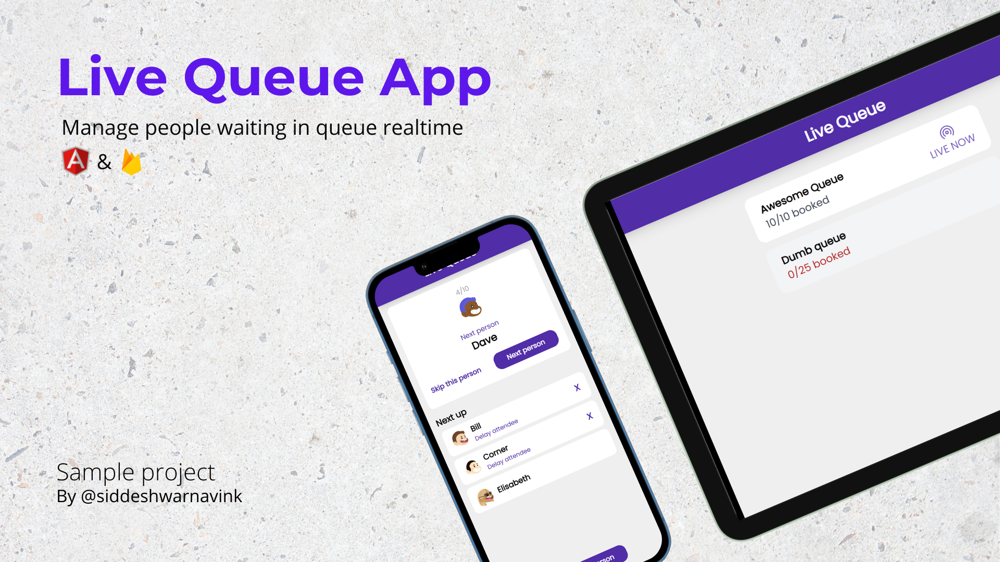

# live-queue-app

A mobile-first web app which helps in manageing people waiting in queue realtime

[LIVE DEMO](https://live-queue-app.web.app/)



## Getting started
To get this project working, firs you need to clone this repository

```bash
git clone <repo-url>
```
now install the dependencies using npm or yarn 

```bash
npm install
```

now go to ``src/app/config/firebase.ts`` and chanege it to your firebase app configuration
```ts

import { initializeApp } from "firebase/app";
import { getFirestore } from "firebase/firestore";

const firebaseConfig = {
    // Your firebase config goes here....
};
```

then setup your firestore [datatbase with sample data](SampleData.md). After that you can run the app using Angular CLI

```bash
ng serve
```

You can find the app working in ``localhost:4200``


## Contributing Content
Edit and fix the sit. Feel free to submit PRs for small issues. For large issues or features open an issue first.

First, fork this repo on Github.

```
git clone <your-forked-repo>
npm install
npm run dev

git checkout -b my-fix
```

## Fix some code
Find something wrong which is need to be fixed?  Make the changes in a branch and run the following code:

```
git commit -m "fix: corrected a typo"
git push origin my-fix
```