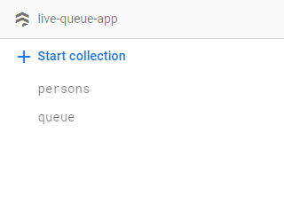
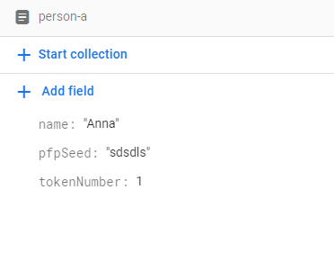
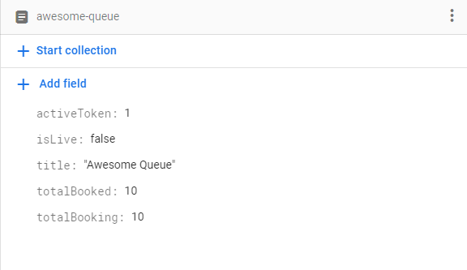

# Structuring the firestore database
The app has really simple database structure. At the root level it has two collections - ``persons``, ``queue``

For persons collection, each person document should have a 
- name (string)
- pfpSeed (string)
- tokenNumber (number)

Now for the queue collection, each document has a
- activeToken (number) set this to 1
- isLive (bool)
- title (string)
- totalBooked (number)
- totalBooking (number)

Now you got your database setup for this app to work!